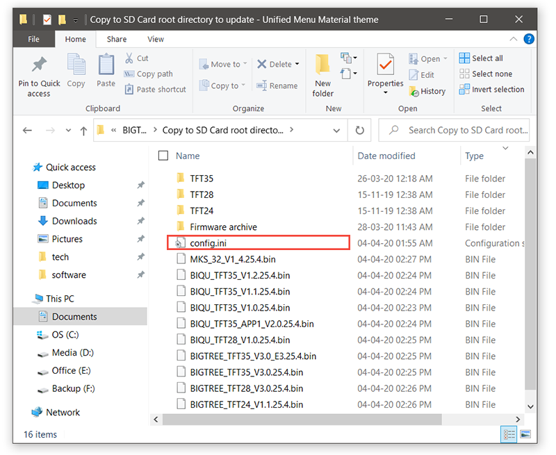
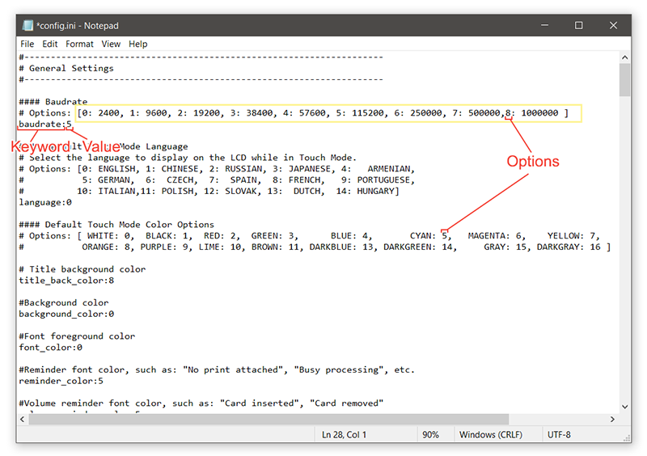
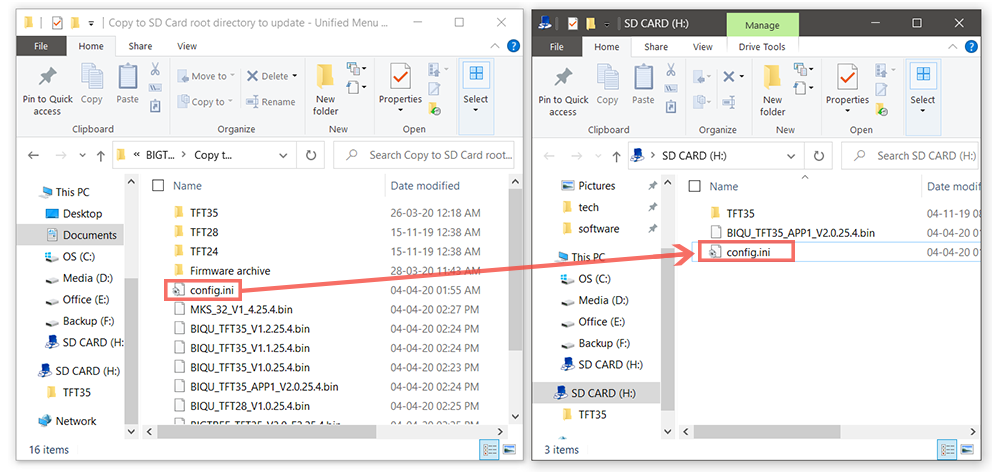

## Firmware configuration using **config.ini** File

**The TFT Firmware can be configured with **config.ini** File without the need to re-compile the firmware.**
use the **config.ini** file from from one of these folders:

[`Copy to SD Card root directory to update`](https://github.com/bigtreetech/BIGTREETECH-TouchScreenFirmware/tree/master/Copy%20to%20SD%20Card%20root%20directory%20to%20update)
or
[`Copy to SD Card root directory to update - Unified Menu Material theme`](https://github.com/bigtreetech/BIGTREETECH-TouchScreenFirmware/tree/master/Copy%20to%20SD%20Card%20root%20directory%20to%20update%20-%20Unified%20Menu%20Material%20theme)

### Editing **config.ini** File:

Before editing config.ini file please read the following points:
   - All the Settings Keywords are in small-caps (a-z) followed by the ' : ' colon sign.
   - If any Keyword has in-valid values then it will be skipped by the TFT Controller and the Keyword with in-valid values will be displayed on the screen during update.
   - Any text after the ' # ' hash sign will not be read by the TFT Controller and it will skip to next line.
   - There should be only one keyword per line. If there are more than one Keywords in one line then only the fist one will be read by the TFT.
   - The Keyword values should start after the ' : ' colon sign.
   - All G-Code strings should be in single Line.
   - To denote EOL / NewLine, Use **\n** in the G-Code strings. The TFT will convert the **\n** to EOL while updating. eg.
     ```
     start_gcode:G28\nG29\nG1 X10 Y10 Z10\n
     ```

### Instructions:
1. Open the **config.ini** File in any text editor like Notepad or Notepad++.
    


2. Change the settings parameter values according to options provided in the **config.ini** file.
    


3. Ignore / Leave the Keywords that are not supported by your TFT Variant. All unsupported Settings Keywords are skipped by the TFT.


4. Save the **config.ini** File.
   Save the **config.ini** File. Do not change the name of the file.


5.  Copy the **config.ini** file to the root directory of the SD card. (The SD card capacity should be less than or equal to 8GB and formatted as FAT32)
   


6. Insert the SD card in the TFT's SD card slot and restart the TFT by pressing the reset buttion or disconnecting and connecting the power cable.


7. The TFT will update and store the configuration from **config.ini** file.
